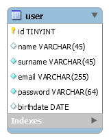

# User table administration

Simple database table administration example. Three solutions are shown:

1. [all-in-one solution](one-file-solution)
1. [with the use of custom functions](functions-solution)
1. object-oriented (SOON - WIP)]

Each solution offers 4 basic operations with user table entries:

1. view a list of all users (SELECT)
1. creating a user (INSERT)
1. editing the user (UPDATE)
1. deleting a user (DELETE)

## Database

## Instalation

1. Start your web server (WAMP / LAMP).
1. Access your DB client (PhpMyAdmin, Adminer, MySQL Workbench ...).
1. Create the **db_user_administration** database.
1. Create table **user** and fill it with some data. You can use [db_user_administration.sql](database/db_user_administration.sql).
1. **Download** or **git clone** my repository to your webserver directory.
1. Check if your DBMS connection data (host address, username, password) matches mine in the examples.
1. Run it in your webklient (Chrome, Firefox, Opera...).
1. Enjoy, study.

## Prerequisites

MySQL (MariaDB), PHP7, Apache

## Note

The solutions created here are designed for study purposes. They do not have to be complete and need to be modified for possible non-school using. Some solutions are not suitable for use in live operation and are only examples to compare.
