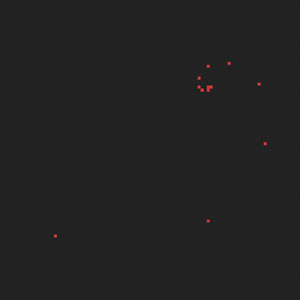
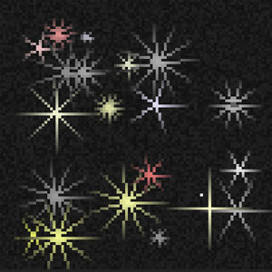

# [HTML Art :-)](html-art)

Examples of content generation for drawing using DIV html tag.

## [Face generated by circles](circle)

## [Attempt a Fibonacci spiral](fibonacci)

## [Random generation of stars](stars)

## Instalation

1. **Download** or **git clone** my repository to your webserver directory.
1. Start your web server (WAMP / LAMP).
1. Run it in your webklient (Chrome, Firefox, Opera...).
1. Enjoy, study.

## Prerequisites

PHP7, Apache

## Note

The solutions created here are designed for study purposes.
